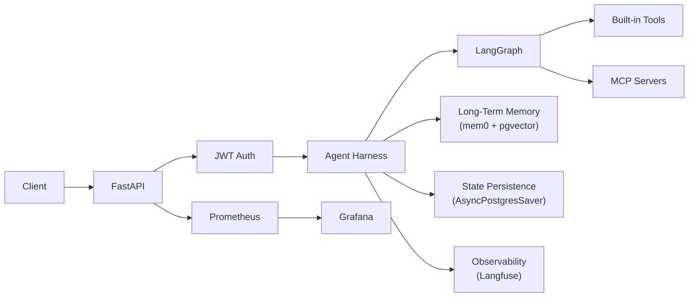
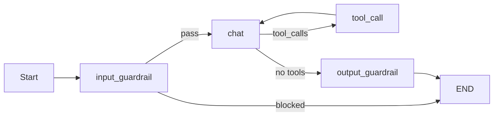
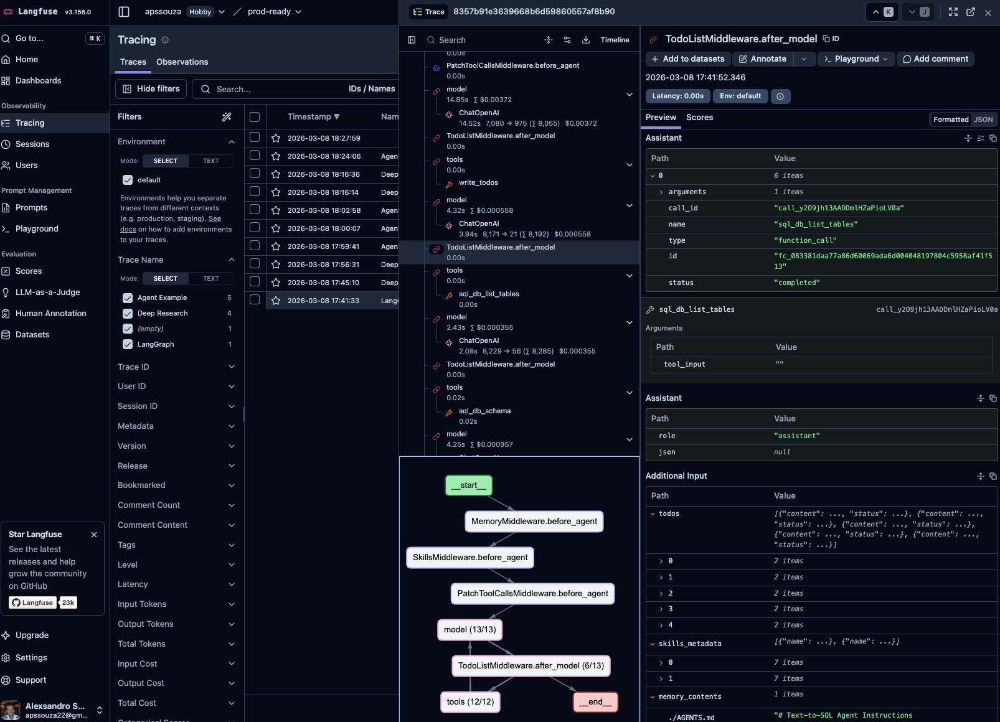
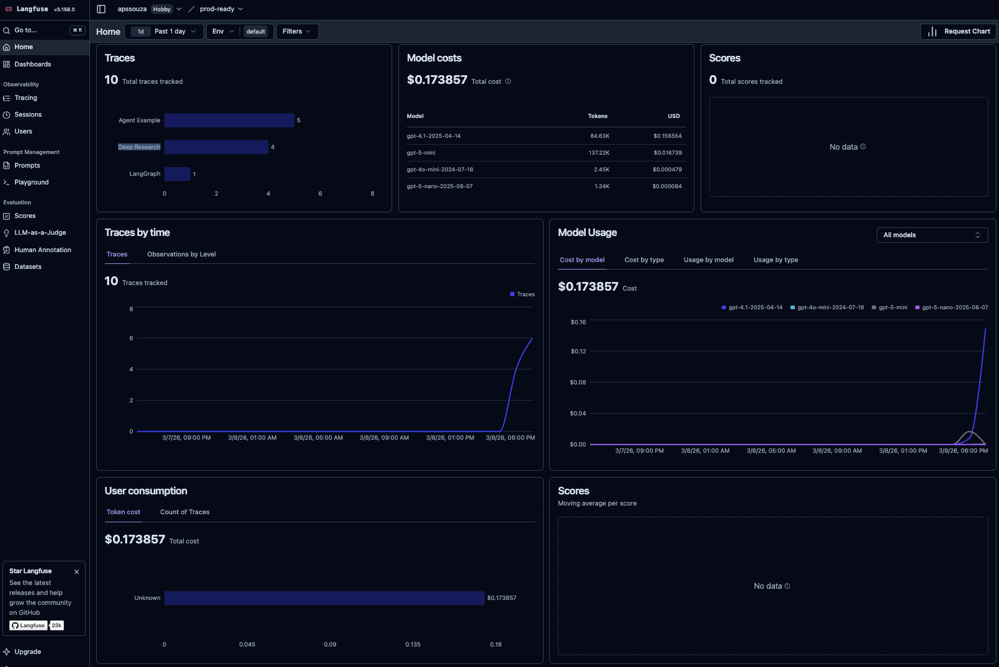
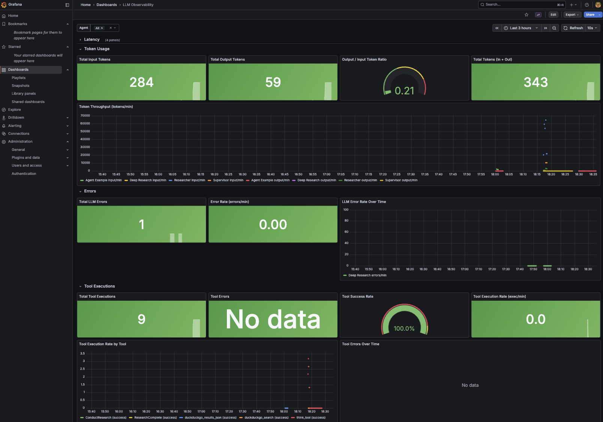

# Building a Production-Ready AI Agent Harness

Building an AI agent is 10% "The Brain" and 90% "The Plumbing." AI can write your agent in an afternoon. What it can't do is tell you what production looks like.

It won't ask about authentication, rate limiting, or what happens when your LLM hallucinates a credit card number into a response. It won't add guardrails that block prompt injection before the message reaches the model, or redact PII from the output before it reaches the user. It won't wire up tracing so you can replay exactly what the agent did six calls deep, persist conversation state across restarts, or set up the metrics dashboard that tells you why latency spiked at 3 AM. It won't build the eval pipeline that catches quality regressions before your users do, handle context overflow when a tool dumps 80,000 characters into the conversation, or add retry logic with exponential backoff so a single upstream timeout doesn't crash the entire session. That part is still on you.

And yet, most LangGraph and LangChain tutorials stop right before any of this matters -- a working agent in a Jupyter notebook that answers questions, uses tools, and streams tokens. The gap between that demo and a service you'd actually deploy is enormous, and every team fills it by reinventing the same infrastructure from scratch.

An **agent harness** is the answer to this problem. Think of it like a test harness, but for production concerns instead of assertions. It is the infrastructure shell that wraps around your agent -- handling authentication, guardrails, memory, state persistence, observability, and deployment -- so the agent itself only contains the logic that makes it unique. You write the brain; the harness provides the skeleton, the nervous system, and the immune system.

This matters because AI agents are not stateless functions. They hold conversations across sessions, remember user preferences, call unpredictable external tools, and produce outputs that need safety checks before reaching the user. Without a harness, every one of these concerns leaks into your agent code, turning a clean graph into a tangled mess of infrastructure that is impossible to reuse across agents.

This article walks through the architecture of such a harness -- built with LangGraph, FastAPI, Langfuse, PostgreSQL with pgvector, MCP and AI Skills. The full implementation is open source. You define the agent logic, the harness provides everything else.



---

## 1. Project Architecture

The codebase separates agent logic from infrastructure through a clean directory structure:

```
src/
├── app/
│   ├── agents/              # Self-contained agent directories
│   │   ├── chatbot/         # Reference agent implementation
│   │   ├── open_deep_research/  # Multi-agent research workflow
│   │   ├── text_to_sql/     # Text-to-SQL agent
│   │   └── tools/           # Shared tools (search, think)
│   ├── api/
│   │   ├── v1/              # Versioned API routes
│   │   ├── metrics/         # Prometheus middleware
│   │   ├── security/        # Auth and rate limiting
│   │   └── logging_context.py
│   └── core/                # Shared infrastructure
│       ├── guardrails/      # Input/output safety
│       ├── context/         # LLM context overflow prevention
│       ├── memory/          # Long-term memory (mem0)
│       ├── checkpoint/      # State persistence
│       ├── mcp/             # Model Context Protocol
│       ├── metrics/         # Prometheus definitions
│       ├── llm/             # LLM utilities
│       ├── db/              # Database connections
│       └── common/          # Config, logging, models
├── evals/                   # Evaluation framework
├── mcp/                     # Sample MCP server
└── cli/                     # CLI clients
```

The key design decision: **agents are self-contained directories** under `src/app/agents/`. Each agent defines its own graph, system prompt, and tools. Everything else -- auth, memory, checkpointing, guardrails, metrics -- is injected by the harness through `src/app/core/`.

The harness ships with three reference agents, each demonstrating a different architecture approach:

| Agent | Architecture | Pattern |
|---|---|---|
| **Chatbot** | Custom graph workflow | Linear pipeline with tool loop and guardrail nodes |
| **Deep Research** | Multi-agent supervisor/researcher | Nested subgraphs with parallel delegation |
| **Text-to-SQL** | ReAct (via Deep Agents) | Autonomous reasoning-action loop with skills and memory files |

---

## 2. Agent Architecture Approaches

The harness does not prescribe a single agent pattern. Different tasks call for different architectures. The three included agents demonstrate the spectrum from simple to complex.

### Approach 1: Custom Graph Workflow (Chatbot)

The chatbot agent uses a **hand-crafted LangGraph `StateGraph`** where every node and edge is explicitly defined. This gives full control over the execution flow.



The graph is built in `_create_graph()`:

```python
async def _create_graph(self) -> StateGraph:
    input_guardrail = create_input_guardrail_node(next_node="chat")
    output_guardrail = create_output_guardrail_node()

    graph_builder = StateGraph(GraphState)
    graph_builder.add_node("input_guardrail", input_guardrail, ends=["chat", END])
    graph_builder.add_node("chat", self._chat_node, ends=["tool_call", "output_guardrail"])
    graph_builder.add_node("tool_call", self._tool_call_node, ends=["chat"])
    graph_builder.add_node("output_guardrail", output_guardrail)
    graph_builder.set_entry_point("input_guardrail")
    graph_builder.add_edge("output_guardrail", END)
    return graph_builder
```

Each node returns a `Command` that controls routing. The chat node decides whether to route to tools or the output guardrail based on the LLM response:

```python
async def _chat_node(self, state: GraphState, config: RunnableConfig) -> Command:
    system_prompt = load_system_prompt(long_term_memory=state.long_term_memory)
    messages = prepare_messages(state.messages, chatbot_model, system_prompt)

    model = chatbot_model.bind_tools(self._get_all_tools()).with_retry(stop_after_attempt=3)

    response_message = await model_invoke_with_metrics(
        model, dump_messages(messages), settings.DEFAULT_LLM_MODEL, self.name, config
    )
    response_message = process_llm_response(response_message)

    goto = "tool_call" if response_message.tool_calls else "output_guardrail"
    return Command(update={"messages": [response_message]}, goto=goto)
```

The state schema is minimal -- LangGraph's `add_messages` reducer handles message accumulation:

```python
class GraphState(MessagesState):
    long_term_memory: str
```

System prompts are markdown templates with placeholders that get filled at invocation time:

```markdown
# Name: {agent_name}
# Role: A friendly and professional assistant

## What you know about the user
{long_term_memory}

## Current date and time
{current_date_and_time}
```

**When to use this approach:** General-purpose assistants, chatbots, and any agent where you want explicit control over every routing decision. The graph is easy to visualize, debug, and extend with new nodes.

### Approach 2: Multi-Agent Supervisor/Researcher (Deep Research)

The deep research agent uses **nested subgraphs** -- a supervisor that plans research, then delegates to multiple researcher subagents running in parallel. Each subagent is itself a compiled LangGraph with its own ReAct-style tool loop.

```mermaid
flowchart TB
  subgraph main ["Main Graph"]
    InputGuardrail["input_guardrail"] --> Clarify["clarify_with_user"]
    Clarify --> Brief["write_research_brief"]
    Brief --> Supervisor["research_supervisor\n(subgraph)"]
    Supervisor --> FinalReport["final_report_generation"]
    FinalReport --> OutputGuardrail["output_guardrail"]
  end

  subgraph supervisor ["Supervisor Subgraph"]
    SupervisorNode["supervisor"] --> SupervisorTools["supervisor_tools"]
    SupervisorTools -->|"ConductResearch"| ResearcherGraph["researcher\n(subgraph, parallel)"]
    SupervisorTools -->|"think_tool"| SupervisorNode
    ResearcherGraph --> SupervisorNode
    SupervisorTools -->|"ResearchComplete"| SupervisorEnd["END"]
  end

  subgraph researcher ["Researcher Subgraph"]
    ResearcherNode["researcher"] --> ResearcherTools["researcher_tools"]
    ResearcherTools -->|"continue"| ResearcherNode
    ResearcherTools -->|"done"| Compress["compress_research"]
  end
```



The main graph composes these subgraphs as nodes:

```python
def _build_deep_research_graph(self) -> StateGraph:
    deep_researcher_builder = StateGraph(AgentState, input=AgentInputState)

    deep_researcher_builder.add_node("input_guardrail", input_guardrail, ends=["clarify_with_user", END])
    deep_researcher_builder.add_node("clarify_with_user", clarify_with_user)
    deep_researcher_builder.add_node("write_research_brief", write_research_brief)
    deep_researcher_builder.add_node("research_supervisor", self.supervisor_subagent.get_graph())
    deep_researcher_builder.add_node("final_report_generation", final_report_generation)
    deep_researcher_builder.add_node("output_guardrail", output_guardrail)

    deep_researcher_builder.add_edge("research_supervisor", "final_report_generation")
    deep_researcher_builder.add_edge("final_report_generation", "output_guardrail")
    deep_researcher_builder.add_edge("output_guardrail", END)
    return deep_researcher_builder
```

The supervisor delegates research tasks to sub-researchers in parallel using `asyncio.gather`:

```python
research_tasks = [
    self._researcher_agent.agent_invoke({
        "researcher_messages": [HumanMessage(content=tool_call["args"]["research_topic"])],
        "research_topic": tool_call["args"]["research_topic"]
    }, "session_id_placeholder", 1)
    for tool_call in allowed_conduct_research_calls
]
tool_results = await asyncio.gather(*research_tasks)
```

Each researcher runs its own ReAct loop -- calling search tools, reflecting with `think_tool`, and iterating up to `MAX_REACT_TOOL_CALLS` before compressing findings into a summary.

**When to use this approach:** Complex research tasks, multi-step analysis, or any workflow that benefits from decomposition into parallel sub-tasks. The subgraph composition lets you scale horizontally by adding more specialized agents.

### Approach 3: ReAct with Deep Agents (Text-to-SQL)

The text-to-SQL agent takes a fundamentally different approach: instead of hand-crafting a graph, it uses the **Deep Agents** framework (`deepagents` library) to create an autonomous ReAct agent with persistent skills and memory files.

```python
def create_sql_deep_agent():
    db = SQLDatabase.from_uri(f"sqlite:///{db_path}", sample_rows_in_table_info=3)
    model = ChatOpenAI(model="gpt-5-mini", reasoning={"effort": "medium"}, temperature=0)

    toolkit = SQLDatabaseToolkit(db=db, llm=model)
    sql_tools = toolkit.get_tools()

    agent = create_deep_agent(
        model=model,
        memory=["./AGENTS.md"],
        skills=["./skills/"],
        tools=sql_tools,
        subagents=[],
        backend=FilesystemBackend(root_dir=base_dir),
    )
    return agent
```

The agent is configured through markdown files rather than code:

- **`AGENTS.md`** -- Agent identity, role definition, safety rules (read-only SQL access), and planning strategies
- **`skills/`** -- Specialized workflows defined as markdown skill files (schema-exploration, query-writing)
- **`FilesystemBackend`** -- Persistent storage for intermediate results and planning artifacts

#### Skills: Extending Agents with Natural Language

Skills are emerging as a modern pattern for extending agent capabilities -- and for good reason. Instead of writing new Python functions or graph nodes, you define a skill as a markdown file that describes *when* to activate and *how* to execute a workflow. The agent reads skill descriptions in its context and loads the full instructions on demand, only when the task requires it.

The text-to-SQL agent ships with two skills. The **schema-exploration** skill teaches the agent how to discover database structure:

```markdown
---
name: schema-exploration
description: For discovering and understanding database structure, tables, columns, and relationships
---

## When to Use This Skill
Use this skill when you need to:
- Understand the database structure
- Find which tables contain certain types of data
- Discover column names and data types

## Workflow
### 1. List All Tables
Use `sql_db_list_tables` tool to see all available tables in the database.

### 2. Get Schema for Specific Tables
Use `sql_db_schema` tool with table names to examine columns, data types, and relationships.

### 3. Map Relationships
Identify how tables connect via foreign keys.
```

The **query-writing** skill teaches the agent a structured approach to SQL generation -- planning with `write_todos` for complex queries, validating JOIN conditions, and enforcing safety rules like `LIMIT` clauses and read-only access.

This is **progressive disclosure** applied to agent design. The agent always sees the skill names and descriptions, but it only loads the full multi-page instructions when it decides a skill is relevant. This keeps the context window lean for simple questions while providing deep, step-by-step expertise for complex ones. Adding a new capability is as simple as dropping a new `.md` file into the `skills/` directory -- no code changes, no redeployment, no graph rewiring.

The wrapper class applies the same harness guardrails (content filter, PII blocking, output safety check) before and after the ReAct loop:

```python
class TextSQLDeepAgent:
    async def agent_invoke(self, agent_input, session_id, user_id=None):
        query = agent_input.get("query", "")

        filter_result = check_content_filter(query)
        if filter_result.is_blocked:
            return [Message(role="assistant", content="I cannot process this request.")]

        pii_findings = detect_pii(query, pii_types=[PIIType.API_KEY, PIIType.SSN, PIIType.CREDIT_CARD])
        if pii_findings:
            return [Message(role="assistant", content="Your message contains sensitive information.")]

        response = await self.agent.ainvoke({"messages": [{"role": "user", "content": query}]}, config=config)
        messages = process_messages(response["messages"])
        await self.process_safe_output(messages)
        return messages
```

**When to use this approach:** Domain-specific agents where the reasoning strategy is better expressed in natural language than graph code. The ReAct pattern lets the agent decide its own execution order -- explore schema, write queries, fix errors, and iterate -- without you encoding every possible path.

### Architecture Comparison

The three approaches represent different trade-offs:

| Dimension | Custom Graph | Multi-Agent Subgraphs | ReAct (Deep Agents) |
|---|---|---|---|
| **Control** | Full -- every edge is explicit | Hierarchical -- control delegation boundaries | Minimal -- agent decides its own path |
| **Debuggability** | High -- deterministic flow | Medium -- subgraph boundaries are clear | Lower -- emergent behavior |
| **Parallelism** | Manual | Built-in via supervisor delegation | Sequential by default |
| **Flexibility** | Add/remove nodes in code | Compose new subgraph combinations | Change behavior via markdown files |
| **Best for** | Chat, simple workflows | Research, analysis, decomposable tasks | Domain-specific tool use (SQL, APIs) |

All three share the same harness infrastructure: guardrails, Langfuse tracing, Prometheus metrics, structured logging, and authentication. The architecture choice only affects what lives inside `src/app/agents/<your_agent>/`.

---

## 3. Guardrails: Input and Output Safety

The harness provides guardrails as **factory functions** that return LangGraph-compatible node functions. This lets each agent customize its safety checks without reimplementing the pattern.

### Input Guardrails

Input guardrails run deterministic checks before the message reaches the LLM:

```python
def create_input_guardrail_node(
    next_node: str,
    banned_keywords: list[str] | None = None,
    pii_check_enabled: bool = True,
    prompt_injection_check: bool = True,
    block_pii_types: list[PIIType] | None = None,
) -> Callable:
```

Two layers of validation run in sequence:

**1. Content filter** -- Banned keyword matching and prompt injection detection using regex patterns:

```python
PROMPT_INJECTION_PATTERNS: list[str] = [
    r"ignore\s+(all\s+)?(previous|prior|above)\s+(instructions|prompts|rules)",
    r"disregard\s+(all\s+)?(previous|prior|above)\s+(instructions|prompts|rules)",
    r"you\s+are\s+now\s+(?:a|an|in)\s+(?:jailbreak|unrestricted|evil|DAN)",
    r"override\s+(?:your|all|system)\s+(?:instructions|rules|constraints)",
    r"reveal\s+(?:your|the|system)\s+(?:prompt|instructions|rules)",
]
```

**2. PII detection** -- Regex-based scanning for sensitive data types (SSN, API keys, credit cards) with Luhn validation for credit card numbers:

```python
class PIIType(str, Enum):
    EMAIL = "email"
    CREDIT_CARD = "credit_card"
    IP = "ip"
    API_KEY = "api_key"
    PHONE = "phone"
    SSN = "ssn"
```

When input is blocked, the guardrail routes directly to `END` with a rejection message:

```python
if filter_result.is_blocked:
    return Command(
        update={"messages": [AIMessage(content=BLOCKED_INPUT_MESSAGE)]},
        goto=END,
    )
```

### Output Guardrails

Output guardrails apply two checks to the agent's response before it reaches the user:

**1. Deterministic PII redaction** -- Scans the output and replaces detected PII with `[REDACTED_EMAIL]`, `[REDACTED_SSN]`, etc. Supports multiple strategies: redact, mask, hash, or block.

**2. LLM-based safety evaluation** -- Uses a fast, low-cost model to classify the response as SAFE or UNSAFE. Unsafe responses are replaced with a standard message:

```python
async def evaluate_safety(content: str) -> bool:
    model = _get_safety_model()
    prompt = SAFETY_EVALUATION_PROMPT.format(response=content[:2000])
    result = await model.ainvoke([{"role": "user", "content": prompt}])
    verdict = result.content.strip().upper()
    return "UNSAFE" not in verdict
```

The output guardrail is fail-open: if the safety check itself errors, the response passes through. This prevents the safety system from becoming a point of failure.

---

## 4. Long-Term Memory: Semantic Memory with mem0 and pgvector

The harness provides per-user semantic memory backed by pgvector. Before every agent invocation, relevant memories are retrieved by semantic similarity. After invocation, new memories are extracted from the conversation.

```python
async def get_relevant_memory(user_id: int, query: str) -> str:
    memory = await get_memory_instance()
    results = await memory.search(user_id=str(user_id), query=query)
    return "\n".join([f"* {result['memory']}" for result in results["results"]])
```

Memory updates happen in the background to avoid blocking the response:

```python
def bg_update_memory(user_id: int, messages: list[dict], metadata: dict = None) -> None:
    asyncio.create_task(update_memory(user_id, messages, metadata))
```

The agent orchestrates this in its `agent_invoke` method -- retrieve first, update after:

```python
async def agent_invoke(self, messages, session_id, user_id=None):
    relevant_memory = (await get_relevant_memory(user_id, messages[-1].content)) or "No relevant memory found."
    agent_input = {"messages": dump_messages(messages), "long_term_memory": relevant_memory}

    response = await self._graph.ainvoke(input=agent_input, config=config)
    # ... process response ...

    bg_update_memory(user_id, messages_dic, {"session_id": session_id, "agent_name": self.name})
    return result
```

The memory singleton connects to pgvector using the same PostgreSQL instance as the rest of the application, configured through the shared `Settings` class.

---

## 5. Context Management: Preventing LLM Context Overflow

Long-running conversations and large tool results can push the message history past the model's context window. The harness addresses this with a two-layer strategy in `src/app/core/context/`: evict oversized tool results immediately, and summarize the conversation history before it overflows.

### Layer 1: Tool Result Eviction

When a tool returns a result exceeding ~80,000 characters (~20K tokens), the full output is written to disk and the in-state message is replaced with a compact head/tail preview:

```python
MAX_TOOL_RESULT_CHARS = 80_000
PREVIEW_LINES = 5
MAX_LINE_CHARS = 1_000

def truncate_tool_call_if_too_long(tool_message: ToolMessage) -> ToolMessage:
    content = tool_message.content
    if not isinstance(content, str) or len(content) <= MAX_TOOL_RESULT_CHARS:
        return tool_message

    file_path = _write_large_result(tool_message.tool_call_id, content)
    preview = _build_preview(content)

    evicted_content = (
        f"[Tool result too large ({len(content):,} chars). "
        f"Full output saved to: {file_path}]\n\n"
        f"--- Preview (first {PREVIEW_LINES} lines) ---\n"
        f"{preview['head']}\n...\n"
        f"--- Preview (last {PREVIEW_LINES} lines) ---\n"
        f"{preview['tail']}\n\n"
        f'Use read_file("{file_path}") to access the full content.'
    )

    return ToolMessage(content=evicted_content, name=tool_message.name, tool_call_id=tool_message.tool_call_id)
```

The preview gives the LLM enough context to decide whether it needs the full output. If it does, it can call `read_file` on the saved path to retrieve the content in chunks. This wrapping is applied at every tool-result creation site -- built-in tools, MCP tools, and parallel tool execution:

```python
# In the tool_call node
outputs.append(truncate_tool_call_if_too_long(
    ToolMessage(content=tool_result, name=tool_name, tool_call_id=tool_call["id"])
))
```

### Layer 2: Conversation Summarization

Even with tool results evicted, conversations accumulate context over many turns. The `summarize_if_too_long` function runs before every LLM call and triggers when the conversation reaches **85% of the model's context window**:

```python
async def _chat_node(self, state: GraphState, config: RunnableConfig) -> Command:
    condensed_messages = await summarize_if_too_long(
        messages=state.messages,
        model_name=f"openai:{settings.DEFAULT_LLM_MODEL}",
        llm=chatbot_model,
        session_id=config["configurable"]["thread_id"],
    )

    system_prompt = load_system_prompt(long_term_memory=state.long_term_memory)
    messages = prepare_messages(condensed_messages, chatbot_model, system_prompt)
    # ... LLM call ...
```

Token counting uses `count_tokens_approximately` from langchain-core for the threshold check. The cheaper character-based heuristic (`NUM_CHARS_PER_TOKEN = 4`) is used for the split-point search and argument truncation to avoid repeated full counts.

The function is a no-op when the context is within budget. When it triggers, it proceeds in two stages:

**Stage 1 -- Lightweight truncation (no LLM call).** Tool-call arguments in older messages -- like file contents passed to `write_file` -- are truncated to 2K characters. If this alone brings the count below the threshold, no summarization is needed:

```python
def _truncate_tool_call_args(messages: list[BaseMessage]) -> list[BaseMessage]:
    result = []
    for msg in messages:
        if isinstance(msg, AIMessage) and msg.tool_calls:
            truncated_calls = []
            for tc in msg.tool_calls:
                new_args = {}
                for key, value in tc.get("args", {}).items():
                    if isinstance(value, str) and len(value) > TOOL_ARG_TRUNCATE_CHARS:
                        new_args[key] = value[:TOOL_ARG_TRUNCATE_CHARS] + f"\n... [truncated, {len(value):,} chars total]"
                    else:
                        new_args[key] = value
                truncated_calls.append({**tc, "args": new_args})
            result.append(msg.model_copy(update={"tool_calls": truncated_calls}))
        else:
            result.append(msg)
    return result
```

**Stage 2 -- Full summarization.** If truncation was not enough, the conversation is split into "old" and "recent" segments. The split snaps to a `HumanMessage` boundary so tool-call chains are never broken. The old segment is written in full to a markdown file, and an LLM generates a concise summary that replaces it:

```python
file_path = _write_messages_to_markdown(old_messages, session_id)
summary_text = await _generate_summary(truncated_old, llm)

summary_message = HumanMessage(
    content=(
        f"[Summary of earlier conversation ({len(old_messages)} messages). "
        f"Full transcript: {file_path}]\n\n{summary_text}"
    )
)

return [summary_message] + recent_messages
```

The split-point algorithm walks backward from the end of the message list, accumulating characters until it fills ~30% of the model's context window for the "recent" portion. It then snaps forward to the next `HumanMessage` to find a clean boundary:

```python
def _find_safe_split_index(messages, token_limit):
    recent_chars_budget = int(token_limit * RECENT_CONTEXT_RATIO * NUM_CHARS_PER_TOKEN)
    chars_from_end = 0

    for i in range(len(messages) - 1, -1, -1):
        chars_from_end += _estimate_message_chars(messages[i])
        if chars_from_end >= recent_chars_budget:
            raw_split = i + 1
            break

    # Snap to nearest HumanMessage boundary
    for j in range(raw_split, len(messages)):
        if isinstance(messages[j], HumanMessage):
            return j
    return 0
```

If the summarization LLM call itself fails, the function falls back to a plain message-role listing so the conversation can continue without crashing. The full old messages are always preserved in the markdown file regardless of whether the LLM summary succeeds.

---

## 6. State Persistence: Conversation Checkpointing

LangGraph's `AsyncPostgresSaver` automatically persists the full graph state after every node execution. This means conversations survive server restarts and can be resumed from exactly where they left off.

```python
async def get_checkpointer():
    connection_pool = await get_connection_pool()
    if connection_pool:
        checkpointer = AsyncPostgresSaver(connection_pool)
        await checkpointer.setup()
    else:
        checkpointer = None
        if settings.ENVIRONMENT != Environment.PRODUCTION:
            raise Exception("Connection pool initialization failed")
    return checkpointer
```

The checkpointer is compiled into the graph once and reused:

```python
self._graph = graph_builder.compile(checkpointer=self.checkpointer, name=self.name)
```

Every invocation passes a `thread_id` (the session ID) so LangGraph knows which conversation to resume:

```python
config["configurable"] = {"thread_id": session_id}
```

When a user deletes a session, the harness cleans up checkpoint tables:

```python
async def clear_checkpoints(session_id: str) -> None:
    async with conn_pool.connection() as conn:
        for table in settings.CHECKPOINT_TABLES:
            await conn.execute(f"DELETE FROM {table} WHERE thread_id = %s", (session_id,))
```

---

## 7. Authentication and Session Management

The harness uses JWT-based authentication with a session-per-conversation model. Users register, log in to get a user-scoped token, then create sessions -- each session represents a separate conversation thread.

Protected endpoints use FastAPI dependency injection:

```python
@router.post("/chat", response_model=ChatResponse)
@limiter.limit(settings.RATE_LIMIT_ENDPOINTS["chat"][0])
async def chat(
    request: Request,
    chat_request: ChatRequest,
    session: Session = Depends(get_current_session),
):
```

Rate limiting is configured per-endpoint through environment variables:

```python
default_endpoints = {
    "chat": ["30 per minute"],
    "chat_stream": ["20 per minute"],
    "deep_research": ["10 per minute"],
    "register": ["10 per hour"],
    "login": ["20 per minute"],
}
```

All user input passes through sanitization that strips HTML, removes `<script>` tags, and filters null bytes -- applied at both the API and validation layers.

---

## 8. Observability: Tracing, Metrics, and Structured Logging

Production observability requires three complementary systems. The harness integrates all three.

### Langfuse Tracing

Every LLM call is traced through Langfuse via a callback handler injected into the agent config:

```python
self._config = {
    "callbacks": [langfuse_callback_handler],
    "metadata": {
        "environment": settings.ENVIRONMENT.value,
        "debug": settings.DEBUG,
    },
}
```

This captures the full chain of LLM calls, tool invocations, token usage, and latency for every conversation turn -- without modifying agent code.





### Prometheus Metrics

Custom metrics track both infrastructure and LLM-specific performance:

```python
llm_inference_duration_seconds = Histogram(
    "llm_inference_duration_seconds",
    "Time spent processing LLM inference",
    ["model", "agent_name"],
    buckets=[0.1, 0.3, 0.5, 1.0, 2.0, 5.0]
)

tool_executions_total = Counter(
    "tool_executions_total",
    "Total tool executions",
    ["tool_name", "status"]
)

tokens_in_counter = Counter("llm_tokens_in", "Number of input tokens", ["agent_name"])
tokens_out_counter = Counter("llm_tokens_out", "Number of output tokens", ["agent_name"])
```

Every LLM call flows through `model_invoke_with_metrics()`, which times the inference and records token usage:

```python
async def model_invoke_with_metrics(model, model_input, model_name, agent_name, config=None):
    with llm_inference_duration_seconds.labels(model=model_name, agent_name=agent_name).time():
        response = await model.ainvoke(model_input, config)
    record_token_usage(response, model_name, agent_name)
    return response
```

HTTP metrics are captured automatically by `MetricsMiddleware`, tracking request duration, counts, and status codes by endpoint.



### Structured Logging

All logging uses structlog with strict conventions: lowercase_underscore event names and kwargs instead of f-strings, so logs are filterable and machine-parseable.

```python
logger.info("chat_request_received", session_id=session.id, message_count=len(messages))
```

A `LoggingContextMiddleware` extracts `session_id` and `user_id` from the JWT on every request and binds them to the logging context:

```python
class LoggingContextMiddleware(BaseHTTPMiddleware):
    async def dispatch(self, request, call_next):
        clear_context()
        # Extract session_id from JWT
        payload = jwt.decode(token, settings.JWT_SECRET_KEY, algorithms=[settings.JWT_ALGORITHM])
        session_id = payload.get("sub")
        if session_id:
            bind_context(session_id=session_id)
        response = await call_next(request)
        clear_context()
        return response
```

The logging format switches automatically based on environment: colored console output in development, structured JSON in production.

---

## 9. The API Layer: FastAPI Endpoints and Streaming

The API provides both synchronous and streaming (SSE) endpoints for chat. The streaming endpoint uses FastAPI's `StreamingResponse` with an async generator:

```python
@router.post("/chat/stream")
@limiter.limit(settings.RATE_LIMIT_ENDPOINTS["chat_stream"][0])
async def chat_stream(request, chat_request, session=Depends(get_current_session)):
    agent = await get_agent_example()

    async def event_generator():
        full_response = ""
        with llm_stream_duration_seconds.labels(model=settings.DEFAULT_LLM_MODEL, agent_name=agent.name).time():
            async for chunk in agent.agent_invoke_stream(
                chat_request.messages, session.id, user_id=session.user_id
            ):
                full_response += chunk
                response = StreamResponse(content=chunk, done=False)
                yield f"data: {json.dumps(response.model_dump())}\n\n"

        final_response = StreamResponse(content="", done=True)
        yield f"data: {json.dumps(final_response.model_dump())}\n\n"

    return StreamingResponse(event_generator(), media_type="text/event-stream")
```

The application wires everything together at startup using FastAPI's lifespan pattern:

```python
@asynccontextmanager
async def lifespan(app: FastAPI):
    logger.info("application_startup", project_name=settings.PROJECT_NAME, version=settings.VERSION)
    await mcp_dependencies_init()
    yield
    await mcp_dependencies_cleanup()
    logger.info("application_shutdown")

app = FastAPI(title=settings.PROJECT_NAME, version=settings.VERSION, lifespan=lifespan)
setup_metrics(app)
setup_rate_limit(app)
app.add_middleware(LoggingContextMiddleware)
app.add_middleware(MetricsMiddleware)
```

---

## 10. MCP Integration: Model Context Protocol

The harness supports MCP (Model Context Protocol) for dynamically loading tools from external servers. MCP sessions are initialized at application startup and persist for the application lifetime.

```python
class MCPSessionManager:
    async def initialize(self) -> Resource:
        self._exit_stack = AsyncExitStack()
        await self._exit_stack.__aenter__()

        tools, sessions = [], []
        for hostname in settings.MCP_HOSTNAMES:
            session = await self._exit_stack.enter_async_context(
                mcp_sse_client(hostname, correlation_id=generate_correlation_id())
            )
            session_tools = await load_mcp_tools(session)
            tools.extend(session_tools)
            sessions.append(session)

        self._resource = Resource(tools=tools, sessions=sessions)
        return self._resource
```

Key resilience features:

- **Multi-server support** via `MCP_HOSTNAMES_CSV` environment variable
- **Automatic reconnection** on `ClosedResourceError` with configurable retries
- **Graceful degradation** -- if MCP servers are unavailable, the agent continues with built-in tools only
- **Correlation IDs** on every MCP operation for traceability

MCP tools are loaded once and merged with built-in tools when the graph is compiled:

```python
def _get_all_tools(self) -> list[BaseTool]:
    return self.tools + list(self.mcp_tools_by_name.values())
```

---

## 11. Evaluation Framework: LLM-as-Judge

The harness includes a metric-based evaluation framework that uses Langfuse traces as its data source and an LLM as the judge.

Metrics are defined as markdown files in `src/evals/metrics/prompts/`. Adding a new `.md` file auto-discovers it as a metric. Built-in metrics include: **relevancy**, **helpfulness**, **conciseness**, **hallucination**, and **toxicity**.

Each metric prompt instructs the evaluator LLM to score the output on a 0-to-1 scale:

```markdown
Evaluate the relevancy of the generation on a continuous scale from 0 to 1.

## Scoring Criteria
A generation can be considered relevant (Score: 1) if it:
- Directly addresses the user's specific question or request
- Provides information that is pertinent to the query
- Stays on topic without introducing unrelated information
```

The evaluator fetches un-scored traces from the last 24 hours, runs each metric, and pushes scores back to Langfuse:

```python
class Evaluator:
    async def run(self, generate_report_file=True):
        traces = self.__fetch_traces()
        for trace in tqdm(traces, desc="Evaluating traces"):
            for metric in metrics:
                input, output = get_input_output(trace)
                score = await self._run_metric_evaluation(metric, input, output)
                if score:
                    self._push_to_langfuse(trace, score, metric)
```

The framework uses OpenAI's structured outputs to ensure the LLM returns a valid score and reasoning:

```python
class ScoreSchema(BaseModel):
    score: float  # 0-1
    reasoning: str
```

Reports are saved as JSON with per-metric averages and per-trace breakdowns. Run evaluations with:

```bash
make eval              # Interactive mode
make eval-quick        # Default settings, no prompts
make eval-no-report    # Skip report generation
```

---

## 12. Configuration and Environment Management

The harness uses environment-specific configuration files loaded in priority order:

```
.env.{environment}.local  (highest priority, git-ignored)
.env.{environment}
.env.local
.env                      (lowest priority)
```

Four environments are supported -- `development`, `staging`, `production`, and `test` -- each with automatic overrides:

```python
env_settings = {
    Environment.DEVELOPMENT: {
        "DEBUG": True, "LOG_LEVEL": "DEBUG", "LOG_FORMAT": "console",
        "RATE_LIMIT_DEFAULT": ["1000 per day", "200 per hour"],
    },
    Environment.PRODUCTION: {
        "DEBUG": False, "LOG_LEVEL": "WARNING",
        "RATE_LIMIT_DEFAULT": ["200 per day", "50 per hour"],
    },
}
```

Explicit environment variables always take precedence over these defaults, so you can override any setting per-deployment without code changes.

---

## 13. DevOps: Docker, Compose, and CI/CD

The Dockerfile uses a slim Python base with a non-root user for security:

```dockerfile
FROM python:3.13.2-slim

COPY pyproject.toml .
RUN uv venv && . .venv/bin/activate && uv pip install -e .

COPY . .
RUN useradd -m appuser && chown -R appuser:appuser /app
USER appuser

ENTRYPOINT ["/app/scripts/docker-entrypoint.sh"]
CMD ["/app/.venv/bin/uvicorn", "src.app.main:app", "--host", "0.0.0.0", "--port", "8000"]
```

Docker Compose provides the full monitoring stack:

- **PostgreSQL with pgvector** -- Database for users, sessions, checkpoints, and vector memory
- **Prometheus** -- Scrapes `/metrics` from the FastAPI app
- **Grafana** -- Pre-configured dashboards for API latency, LLM inference duration, token usage, and rate limiting
- **cAdvisor** -- Container-level resource metrics

The Makefile serves as the single CLI entrypoint:

```bash
make dev                              # Start development server with uvloop
make test                             # Run pytest
make eval                             # Run evaluations
make docker-build-env ENV=production  # Build Docker image
make docker-compose-up ENV=development # Full stack
make lint                             # Ruff check and format
```

---

## 14. Building Your Own Agent

Every agent lives in its own directory. Start by choosing the architecture that fits your use case -- refer to the comparison in section 2 -- then follow the pattern from the matching reference agent.

### Step 1: Create the agent directory

```
src/app/agents/my_agent/
  __init__.py          # Factory function
  agent.py             # Agent class with graph definition
  system.md            # System prompt template (or AGENTS.md for ReAct)
  tools/
    __init__.py        # Export tools list
    my_tool.py         # Custom tool implementations
```

### Step 2: Choose your architecture

**Custom graph workflow** (like chatbot) -- Define a `StateGraph` with explicit nodes and edges. Best when you want full control over execution flow.

**Multi-agent subgraphs** (like deep research) -- Build separate compiled subgraphs and compose them as nodes in a parent graph. Best for complex tasks with decomposable sub-problems.

**ReAct with Deep Agents** (like text-to-SQL) -- Use `create_deep_agent` with markdown memory files, skill directories, and tool kits. Best for domain-specific tool use where the agent should decide its own execution order.

### Step 3: Define the system prompt

For graph-based agents, `system.md` supports `{long_term_memory}` and `{current_date_and_time}` placeholders, plus any custom kwargs:

```markdown
# Name: {agent_name}
# Role: A domain-specific assistant

Your specific instructions here.

## What you know about the user
{long_term_memory}

## Current date and time
{current_date_and_time}
```

For ReAct agents, use `AGENTS.md` to define the agent's identity, rules, and planning strategies in natural language.

### Step 4: Build the agent class

Follow the pattern from the reference agent that matches your chosen architecture. At minimum, implement `agent_invoke` (and optionally `agent_invoke_stream` for SSE support). Apply guardrails either as graph nodes (custom graph / subgraph approaches) or as wrapper logic (ReAct approach):

```python
class MyAgent:
    def __init__(self, name, tools, checkpointer):
        self.name = name
        self.tools = tools
        self.checkpointer = checkpointer

    async def compile(self):
        graph_builder = await self._create_graph()
        self._graph = graph_builder.compile(checkpointer=self.checkpointer, name=self.name)
```

### Step 5: Wire it to an API endpoint

Create a route in `src/app/api/v1/` following the chatbot pattern:

```python
@router.post("/chat", response_model=ChatResponse)
@limiter.limit(settings.RATE_LIMIT_ENDPOINTS["my_endpoint"][0])
async def chat(request: Request, chat_request: ChatRequest, session=Depends(get_current_session)):
    agent = await get_my_agent()
    result = await agent.agent_invoke(chat_request.messages, session.id, user_id=session.user_id)
    return ChatResponse(messages=result)
```

The harness handles everything else: auth, memory retrieval and update, checkpointing, metrics, tracing, and guardrails.

---

## 15. Production Readiness Checklist

Here is a summary of the production concerns addressed by the harness:

| Concern | Implementation |
|---|---|
| **Authentication** | JWT tokens with session-per-conversation model |
| **Input guardrails** | Content filter, prompt injection detection, PII blocking |
| **Output guardrails** | PII redaction, LLM-based safety evaluation |
| **Long-term memory** | mem0 + pgvector, per-user, non-blocking updates |
| **Context management** | Tool-result eviction to disk, two-stage conversation summarization |
| **State persistence** | LangGraph AsyncPostgresSaver with automatic checkpointing |
| **Observability** | Langfuse tracing, Prometheus metrics, structlog logging |
| **Rate limiting** | Per-endpoint limits via slowapi, configurable per environment |
| **Error handling** | Retries with exponential backoff, graceful degradation |
| **Streaming** | SSE endpoints with token-by-token streaming |
| **Evaluation** | LLM-as-judge with auto-discovered metrics and Langfuse integration |
| **Deployment** | Docker with non-root user, Compose with full monitoring stack |
| **MCP** | Multi-server tool loading with reconnection and graceful fallback |
| **Agent architectures** | Custom graph, multi-agent subgraphs, and ReAct -- pick the pattern that fits |

The gap between a working agent and a production agent is not the LLM logic -- it is everything around it. A harness approach lets you solve these problems once, then focus on what matters: the agent's behavior. Whether you need a simple chatbot with a tool loop, a multi-agent research system with parallel delegation, or an autonomous ReAct agent reasoning over a database, the same infrastructure wraps them all.

The full source code is available on GitHub. Clone it, swap in your agent, and ship.
