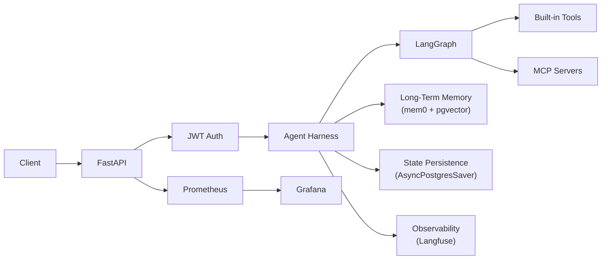

# Agent Harness -- Production-Ready AI Agent Infrastructure

A harness for building and running AI agents in production. 
You define the agent logic; the harness provides authentication, memory, observability, state persistence, rate limiting, and monitoring out of the box.

Built with **LangGraph**, **FastAPI**, **Langfuse**, **PostgreSQL + pgvector**, and **MCP**.

## Architecture



Your agent is a self-contained directory under `src/app/agents/`. It extends `AgentAbstract`, defines its own graph, system prompt, and tools. The harness handles everything else.

## What You Get

**Agent Abstraction**
- `AgentAbstract` base class with built-in tool calling, MCP integration, memory retrieval, and streaming
- Self-contained agent directories: each agent owns its graph, prompt, and tools
- Automatic MCP tool discovery and reconnection with graceful degradation

**API Layer**
- FastAPI with async endpoints and uvloop optimization
- JWT-based authentication with session management (register, login, multi-session)
- Per-endpoint rate limiting via slowapi
- Streaming responses (SSE) for real-time chat

**Memory and State**
- Long-term semantic memory via mem0ai + pgvector (per-user, automatic extraction and retrieval)
- Conversation state persistence via LangGraph `AsyncPostgresSaver` checkpointing
- Background memory updates that don't block responses

**Observability**
- Langfuse tracing on all LLM calls with environment and session metadata
- Prometheus metrics for API performance, rate limits, LLM inference duration
- Grafana dashboards (pre-configured)
- Structured logging with structlog: JSON in production, colored console in development
- Automatic request context binding (request_id, session_id, user_id)

**LLM Management**
- Multi-model registry (GPT-5, GPT-5-mini, GPT-5-nano, GPT-4o, GPT-4o-mini)
- Circular fallback: if the primary model fails, the service tries the next model in the registry
- Automatic retries with exponential backoff via tenacity
- Environment-specific tuning (temperature, top_p, penalties)

**Evaluation Framework**
- Metric-based evaluation of model outputs using Langfuse traces
- Built-in metrics: relevancy, helpfulness, conciseness, hallucination, toxicity
- JSON reports with per-metric and per-trace breakdowns
- Interactive CLI with colored output

**DevOps**
- Docker Compose stack: PostgreSQL (pgvector), Prometheus, Grafana, cAdvisor
- Environment-specific configs (`.env.development`, `.env.staging`, `.env.production`)
- Makefile for all common operations
- GitHub Actions CI/CD workflow

## Build Your Own Agent

Every agent lives in its own directory under `src/app/agents/`. The included `example1` agent is a working reference.

### 1. Create the agent directory

```
src/app/agents/my_agent/
  __init__.py          # load_system_prompt() helper
  agent.py             # Your agent class
  system.md            # System prompt template
  tools/
    __init__.py        # Export your tools list
    my_tool.py         # Custom tool implementations
```

### 2. Define the system prompt

`system.md` supports `{long_term_memory}` and `{current_date_and_time}` placeholders, plus any custom kwargs you pass.

```markdown
# Name: {agent_name}
# Role: Your agent's role description

Instructions for the agent.

# What you know about the user
{long_term_memory}

# Current date and time
{current_date_and_time}
```

### 3. Implement the agent

Extend `AgentAbstract` and implement `_create_graph()`:

```python
from langgraph.graph import END
from langgraph.graph.state import StateGraph
from langgraph.types import RunnableConfig, Command

from src.app.core.agentic.agent_base import AgentAbstract
from src.app.core.common.model.graph import GraphState


class MyAgent(AgentAbstract):

    async def _chat_node(self, state: GraphState, config: RunnableConfig) -> Command:
        system_prompt = load_system_prompt(long_term_memory=state.long_term_memory)
        messages = prepare_messages(state.messages, self.llm_service.get_llm(), system_prompt)
        response = await self.llm_service.call(dump_messages(messages))
        response = process_llm_response(response)

        if response.tool_calls:
            return Command(update={"messages": [response]}, goto="tool_call")
        return Command(update={"messages": [response]}, goto=END)

    async def _create_graph(self) -> StateGraph:
        graph = StateGraph(GraphState)
        graph.add_node("chat", self._chat_node, ends=["tool_call", END])
        graph.add_node("tool_call", self._tool_call_node, ends=["chat"])
        graph.set_entry_point("chat")
        graph.set_finish_point("chat")
        return graph
```

The base class gives you for free:
- `agent_invoke()` and `agent_invoke_stream()` -- invoke/stream with memory retrieval and background updates
- `_tool_call_node()` -- handles both built-in and MCP tool calls with reconnection logic
- `get_chat_history()` -- retrieves conversation history from checkpoints
- Automatic Langfuse tracing via `config["callbacks"]`

### 4. Wire it to an API endpoint

```python
from src.app.agents.my_agent.agent import MyAgent
from src.app.agents.my_agent.tools import tools

async def get_my_agent() -> MyAgent:
    agent = MyAgent("My Agent", llm_service, tools, await get_checkpointer())
    await agent.compile()
    return agent
```

Then use `agent.agent_invoke()` or `agent.agent_invoke_stream()` in your route handler, exactly as `src/app/api/v1/chatbot.py` does with `AgentExample1`.

## Quick Start

### Prerequisites

- Python 3.13+
- PostgreSQL with pgvector extension
- Docker and Docker Compose (optional)

### Setup

```bash
# Clone and install
git clone <repository-url>
cd <project-directory>
uv sync

# Configure environment
cp .env.example .env.development
# Edit .env.development with your keys (OPENAI_API_KEY, POSTGRES_*, LANGFUSE_*, JWT_SECRET_KEY)

# Run
make dev
```

Swagger UI: `http://localhost:8000/docs`

### Database

The ORM creates tables automatically. If needed, run `schema.sql` manually. Configure in your `.env` file:

```bash
POSTGRES_HOST=localhost
POSTGRES_PORT=5432
POSTGRES_DB=cool_db
POSTGRES_USER=postgres
POSTGRES_PASSWORD=postgres
```

### Docker

```bash
# Build and run for a specific environment
make docker-build-env ENV=development
make docker-run-env ENV=development

# Full stack (API + PostgreSQL + Prometheus + Grafana + cAdvisor)
make docker-compose-up ENV=development
```

Monitoring endpoints:
- Prometheus: `http://localhost:9090`
- Grafana: `http://localhost:3000` (admin/admin)

## Project Structure

```
src/
  app/
    agents/                    # Your agents live here
      example1/                # Reference agent implementation
        __init__.py            #   load_system_prompt()
        agent_example.py       #   AgentExample1(AgentAbstract)
        system.md              #   System prompt template
        tools/                 #   Agent-specific tools
          duckduckgo_search.py
    api/
      v1/                      # Versioned API routes
        auth.py                #   Register, login, sessions
        chatbot.py             #   Chat and streaming endpoints
      logging_context.py       # Request context middleware
      metrics/                 # Prometheus metrics middleware
      security/                # JWT auth, rate limiter
    core/
      agentic/
        agent_base.py          # AgentAbstract base class
      checkpoint/              # LangGraph state persistence
      common/                  # Config, logging, models, metrics
      db/                      # Database connection pooling
      llm/                     # LLM registry and service
      mcp/                     # MCP session manager and utils
      memory/                  # Long-term memory (mem0ai)
      session/                 # Session model and repository
      user/                    # User model and repository
  cli/
    api_client.py              # Interactive CLI client
  evals/
    evaluator.py               # Evaluation engine
    metrics/prompts/           # Evaluation metric definitions
  mcp/
    server.py                  # Sample MCP server
```

## Configuration

Environment-specific files: `.env.development`, `.env.staging`, `.env.production`

Key variables:

| Category | Variable | Default |
|----------|----------|---------|
| App | `APP_ENV` | `development` |
| LLM | `OPENAI_API_KEY` | -- |
| LLM | `DEFAULT_LLM_MODEL` | `gpt-5-mini` |
| LLM | `MAX_TOKENS` | `2000` |
| Memory | `LONG_TERM_MEMORY_MODEL` | `gpt-5-nano` |
| Memory | `LONG_TERM_MEMORY_EMBEDDER_MODEL` | `text-embedding-3-small` |
| Observability | `LANGFUSE_PUBLIC_KEY` | -- |
| Observability | `LANGFUSE_SECRET_KEY` | -- |
| Observability | `LANGFUSE_HOST` | `https://cloud.langfuse.com` |
| Auth | `JWT_SECRET_KEY` | -- |
| Auth | `JWT_ACCESS_TOKEN_EXPIRE_DAYS` | `30` |
| Database | `POSTGRES_HOST` | `localhost` |
| Database | `POSTGRES_PORT` | `5432` |
| MCP | `MCP_ENABLED` | `true` |
| MCP | `MCP_HOSTNAMES_CSV` | -- |
| Rate Limit | `RATE_LIMIT_DEFAULT` | `200/day, 50/hour` |

See `.env.example` for the complete list.

## Key Capabilities

### Long-Term Memory

Powered by mem0ai with pgvector. Memories are stored per user and retrieved by semantic similarity before each agent invocation. Memory updates happen in the background via `asyncio.create_task` so they never block the response.

### LLM Service

The `LLMService` maintains a registry of models and provides:
- Automatic retries (3 attempts, exponential backoff) on rate limits, timeouts, and API errors
- Circular fallback through all registered models when one fails
- Tool binding across model switches

| Model | Use Case | Reasoning Effort |
|-------|----------|-----------------|
| gpt-5 | Complex reasoning | Medium |
| gpt-5-mini | Balanced performance | Low |
| gpt-5-nano | Fast responses | Minimal |
| gpt-4o | Production workloads | N/A |
| gpt-4o-mini | Cost-effective tasks | N/A |

### Model Context Protocol (MCP)

MCP sessions are initialized at application startup and persist for the application lifetime. Features:
- Multi-server support via `MCP_HOSTNAMES_CSV`
- Automatic reconnection on `ClosedResourceError` with configurable retries
- Graceful degradation: the app continues with built-in tools if MCP servers are unavailable
- Includes a sample MCP server (`src/mcp/server.py`)

Start MCP server: `python src/mcp/server.py`

### Structured Logging

All logs use structlog with `lowercase_underscore` event names and kwargs (no f-strings). Request context (session_id, user_id) is automatically bound via middleware. Format switches between colored console (development) and JSON (production).

### Model Evaluation

```bash
make eval                # Interactive mode
make eval-quick          # Default settings, no prompts
make eval-no-report      # Skip report generation
```

Metrics are defined as markdown files in `src/evals/metrics/prompts/`. Add a new `.md` file and the evaluator discovers it automatically. Reports are saved to `src/evals/reports/`.

### Monitoring

Docker Compose includes Prometheus, Grafana, and cAdvisor. Pre-configured dashboards cover:
- API request rate, latency, and error rate
- LLM inference duration by model
- Rate limiting statistics
- System resource usage

## API Reference

### Authentication

| Method | Endpoint | Description |
|--------|----------|-------------|
| POST | `/api/v1/auth/register` | Register a new user |
| POST | `/api/v1/auth/login` | Login, receive JWT token |
| POST | `/api/v1/auth/session` | Create a chat session |
| GET | `/api/v1/auth/sessions` | List user sessions |
| PATCH | `/api/v1/auth/session/{id}/name` | Rename a session |
| DELETE | `/api/v1/auth/session/{id}` | Delete a session |

### Chat

| Method | Endpoint | Description |
|--------|----------|-------------|
| POST | `/api/v1/chatbot/chat` | Send message, receive response |
| POST | `/api/v1/chatbot/chat/stream` | Send message, receive SSE stream |
| GET | `/api/v1/chatbot/messages` | Get conversation history |
| DELETE | `/api/v1/chatbot/messages` | Clear conversation history |

### Health and Monitoring

| Method | Endpoint | Description |
|--------|----------|-------------|
| GET | `/api/v1/health` | Health check with DB status |
| GET | `/metrics` | Prometheus metrics |

Full API docs available at `/docs` (Swagger) and `/redoc` when the application is running.

## CLI Client

```bash
# Register and chat
python src/cli/api_client.py --email user@example.com --password YourPass123 --register

# Login and chat
python src/cli/api_client.py --email user@example.com --password YourPass123

# With custom message
python src/cli/api_client.py --email user@example.com --password YourPass123 --message "What can you do?"
```

The CLI enters interactive mode after the first message.

## License

This project is licensed under the terms specified in the [LICENSE](LICENSE) file.

## Contributing

Contributions are welcome. Please ensure:

1. Code follows the project's coding standards
2. All tests pass
3. New features include appropriate tests
4. Documentation is updated
5. Commit messages follow conventional commits format
